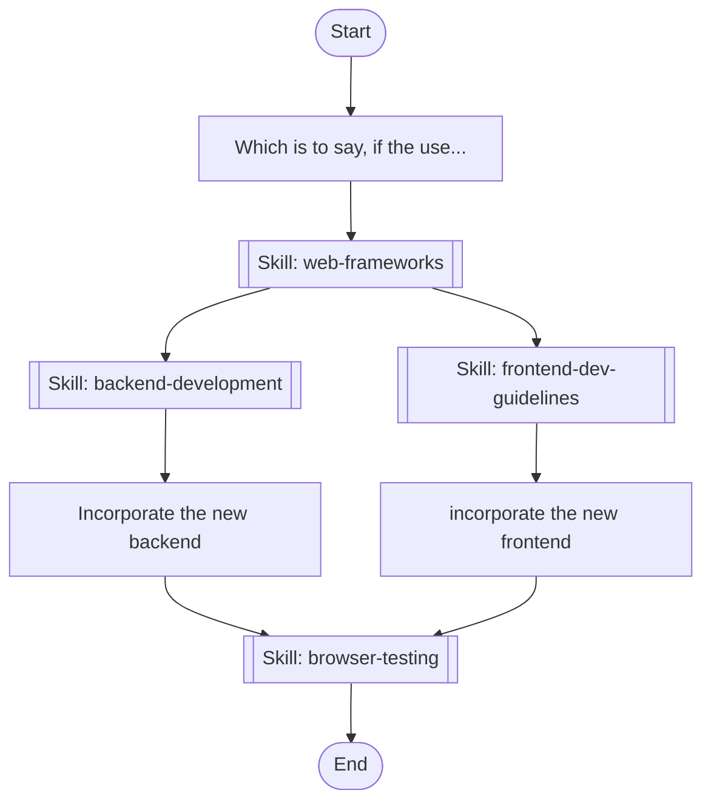

# my-workflow

## Workflow Diagram



## Execution Instructions

## Workflow Execution Guide

Follow the Mermaid flowchart above to execute the workflow. Each node type has specific execution methods as described below.

### Execution Methods by Node Type

- **Rectangle nodes (Sub-Agent: ...)**: Execute Sub-Agents
- **Diamond nodes (AskUserQuestion:...)**: Prompt the user with a question and branch based on their response
- **Diamond nodes (Branch/Switch:...)**: Automatically branch based on the results of previous processing (see details section)
- **Rectangle nodes (Prompt nodes)**: Execute the prompts described in the details section below

## Skill Nodes

#### skill-1775835216866(frontend-dev-guidelines)

- **Prompt**: skill "frontend-dev-guidelines" load-skill-knowledge-into-context-only

#### skill-1775835286131(web-frameworks)

- **Prompt**: skill "web-frameworks" load-skill-knowledge-into-context-only

#### skill-1775835332819(backend-development)

- **Prompt**: skill "backend-development" load-skill-knowledge-into-context-only

#### skill-1775836671004(browser-testing)

- **Prompt**: skill "browser-testing"

### Prompt Node Details

#### prompt-1775833918945(Which is to say, if the use...)

```
Which is to say, if the user wants only 12 tokens--sure, that might be ridiculous, but we should take and use those 12 tokens, not fail out because we were hoping for 5000.  If that means treating incoming data as completely non-structured, that's fine--we know the general shape and keys to look for.  We either need a **very** forgiving JSON parser or we need to write out own.

Switch to receiving streaming (SSE) and parsing/fixing with jsonrepair. https://github.com/josdejong/jsonrepair.  Truncated outputs should cause a 'Continue' button to be presented to the end user that would ask the model to finish it;'s intererupted {{response}}.
```

#### prompt-1775836242197(Incorporate the new backend)

```
Incorporate the new backend
```

#### prompt-1775836282649(incorporate the new frontend)

```
incorporate the new frontend
```
