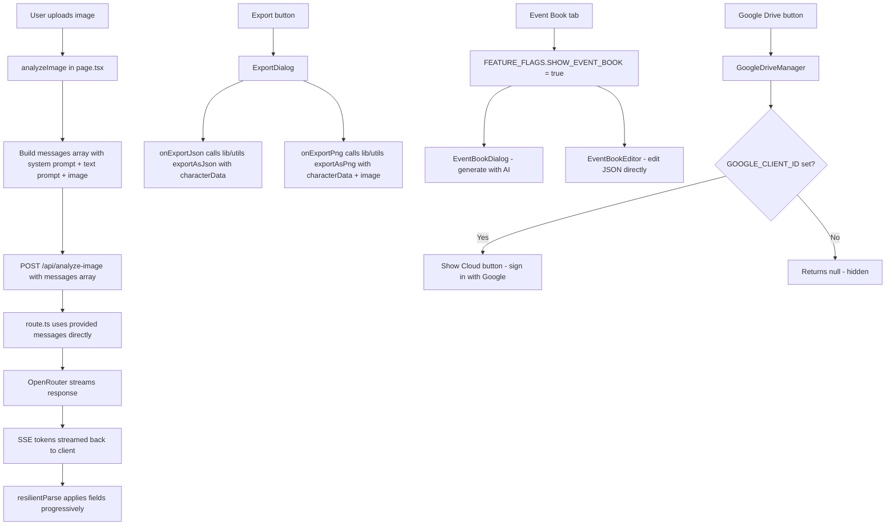

# AIRole-OR: Unused Imports & Feature Enablement Plan

> Goals
>
> - First, move program's code folders to src/ subdirectory. Update aliases and reference
> - Enable latent functionality
> - Reduce size of of primary page.ts by moving functions to their own files
> - Get all type definitions moved to the the type/ fold

## Status Summary

| #   | Item                                                             | Status                                                  |
| --- | ---------------------------------------------------------------- | ------------------------------------------------------- |
| 1   | Enable Event Book feature flag                                   | ✅ Done (`SHOW_EVENT_BOOK: true` in `lib/constants.ts`) |
| 2   | Bug: Dead `messages` array in `analyzeImage()`                   | ⏳ Pending                                              |
| 3   | Remove duplicate `exportAsJson`/`exportAsPng` in `page.tsx`      | ⏳ Pending                                              |
| 4   | Remove unused `IMAGE_MODEL_OPTIONS`/`CHAT_MODEL_OPTIONS` imports | ⏳ Pending                                              |
| 5   | Google Drive activation (env vars)                               | ⏳ Pending                                              |

---

## Bug: Dead `messages` Array in `analyzeImage()` — Prompts Not Reaching Provider

### Root Cause

In `app/page.tsx` (lines 545–569), `analyzeImage()` builds a well-structured `messages` array:

```ts
const messages = continuationContent
  ? [ { role: 'system', content: '...' }, { role: 'user', content: [...] } ]
  : [ { role: 'system', content: '...' }, { role: 'user', content: [
        { type: 'text', text: prompts.imageAnalysis },
        { type: 'image_url', image_url: { url: imageDataUrl } },
      ]}
  ]
```

But the `fetch` call at line 571 **never sends this array**:

```ts
// page.tsx lines 571–581 — messages is NOT included
const response = await fetch('/api/analyze-image', {
  method: 'POST',
  body: JSON.stringify({
    image: imageDataUrl, // ← only the raw image
    apiKey,
    apiBaseUrl,
    model: imageModel,
    prompt: prompts.imageAnalysis, // ← only the prompt string
  }),
})
```

The `messages` variable is **completely dead code**. The route (`app/api/analyze-image/route.ts`) receives only `image` + `prompt` and reconstructs its own messages array — which works for the basic case but:

1. **Loses the continuation system prompt** (the "you ran out of tokens, continue from here" message) — continuation requests send the wrong context to the model
2. **The `messages` construction in `page.tsx` is wasted work** — it is never used

### Fix

**Pass `messages` to the route and use them**

In `app/page.tsx`, add `messages` to the fetch body:

```ts
body: JSON.stringify({
  image: imageDataUrl,
  apiKey,
  apiBaseUrl,
  model: imageModel,
  prompt: prompts.imageAnalysis,
  messages, // ← ADD THIS
})
```

In `app/api/analyze-image/route.ts`, destructure `messages` and use it when provided:

```ts
const { image, apiKey, apiBaseUrl, model, prompt, max_tokens, messages } = await req.json()

// Use provided messages if available, otherwise build default
const chatMessages = messages || [
  {
    role: 'system',
    content: 'You are a famous fiction author. Analyze images and generate character card data in valid JSON format only.',
  },
  {
    role: 'user',
    content: [
      { type: 'text', text: analysisPrompt },
      { type: 'image_url', image_url: { url: image } },
    ],
  },
]

const stream = await openai.chat.completions.create({
  model,
  messages: chatMessages,   // ← use chatMessages instead of hardcoded array
  ...
})
```

---

## Feature 1: Remove Duplicate Export Functions

### Root Cause

`app/page.tsx` line 44 imports `exportAsJson` and `exportAsPng` from `@/lib/utils`:

```ts
import { extractJsonFromContent, exportAsJson, exportAsPng, getLanguagePrompts } from '@/lib/utils'
```

But then immediately **shadows them** with identically-named local functions at lines 903 and 915. The `lib/utils` versions are never called.

### Fix

**In `app/page.tsx`:**

1. Delete the local `exportAsJson` function body (~lines 903–913):

```ts
// DELETE THIS ENTIRE FUNCTION:
const exportAsJson = () => {
  const dataStr = JSON.stringify(characterData, null, 2)
  ...
}
```

2. Delete the local `exportAsPng` function body (~lines 915–988):

```ts
// DELETE THIS ENTIRE FUNCTION:
const exportAsPng = async () => {
  try {
    ...
  }
}
```

3. Update the `ExportDialog` props (~line 2571) to wrap the `lib/utils` versions with the required arguments:

```tsx
// BEFORE:
onExportJson={exportAsJson}
onExportPng={exportAsPng}

// AFTER:
onExportJson={() => exportAsJson(characterData)}
onExportPng={() => exportAsPng(characterData, characterImage)}
```

The `lib/utils` versions (`lib/utils.ts` lines 44 and 56) have identical logic and accept `(characterData, characterImage)` as parameters.

---

## Feature 3: Remove Unused Constant Imports

### Root Cause

`app/page.tsx` line 34 imports `IMAGE_MODEL_OPTIONS` and `CHAT_MODEL_OPTIONS` from `@/lib/constants`, but neither symbol is referenced anywhere in `page.tsx`. Model options are consumed via `getLanguageSpecificModelOptions()` inside `SettingsDialog`.

### Fix

**In `app/page.tsx`**, remove the two unused names from the import block (lines 32–41):

```ts
// BEFORE:
import {
  DEFAULT_CONFIGS,
  ADJUSTMENT_PRESETS,
  IMAGE_MODEL_OPTIONS, // ← REMOVE
  CHAT_MODEL_OPTIONS, // ← REMOVE
  LANGUAGE_OPTIONS,
  INTERFACE_LANGUAGE_OPTIONS,
  getLanguageSpecificConfig,
  getLanguageSpecificModelOptions,
  FEATURE_FLAGS,
} from '@/lib/constants'

// AFTER:
import {
  DEFAULT_CONFIGS,
  ADJUSTMENT_PRESETS,
  LANGUAGE_OPTIONS,
  INTERFACE_LANGUAGE_OPTIONS,
  getLanguageSpecificConfig,
  getLanguageSpecificModelOptions,
  FEATURE_FLAGS,
} from '@/lib/constants'
```

---

## Feature 4: Activate Google Drive Integration

### Root Cause

`components/GoogleDriveManager.tsx` line 332 returns `null` when `GOOGLE_CLIENT_ID`/`GOOGLE_CLIENT_SECRET` env vars are absent. The component is already imported and rendered in `page.tsx` — it just needs environment configuration.

The NextAuth route (`app/api/auth/[...nextauth]/route.ts`) and all Drive API routes (`app/api/google-drive/list|load|save`) are fully implemented.

Add a script for npm to create the .env file through 'npm run'

### Fix: Create `.env` (not committed to git)

```env
# Google OAuth — required for Google Drive sync
GOOGLE_CLIENT_ID=your-google-oauth-client-id
GOOGLE_CLIENT_SECRET=your-google-oauth-client-secret

# NextAuth — required for session management
NEXTAUTH_SECRET=any-random-32-character-string
NEXTAUTH_URL=http://localhost:3000
```

## File Change Summary

| File                             | Change                                                         | Lines Affected   |
| -------------------------------- | -------------------------------------------------------------- | ---------------- |
| `lib/constants.ts`               | ✅ `SHOW_EVENT_BOOK: true`                                     | line 11          |
| `app/page.tsx`                   | Add `messages` to fetch body in `analyzeImage()`               | ~line 574        |
| `app/api/analyze-image/route.ts` | Destructure + use `messages` when provided                     | lines 6, 36–55   |
| `app/page.tsx`                   | Delete local `exportAsJson` function                           | ~lines 903–913   |
| `app/page.tsx`                   | Delete local `exportAsPng` function                            | ~lines 915–988   |
| `app/page.tsx`                   | Update `ExportDialog` props to call `lib/utils` versions       | ~lines 2571–2572 |
| `app/page.tsx`                   | Remove `IMAGE_MODEL_OPTIONS`, `CHAT_MODEL_OPTIONS` from import | line 34          |
| `.env`                           | New file — Google OAuth credentials                            | new file         |

---

## Architecture Flow (After Fixes)


